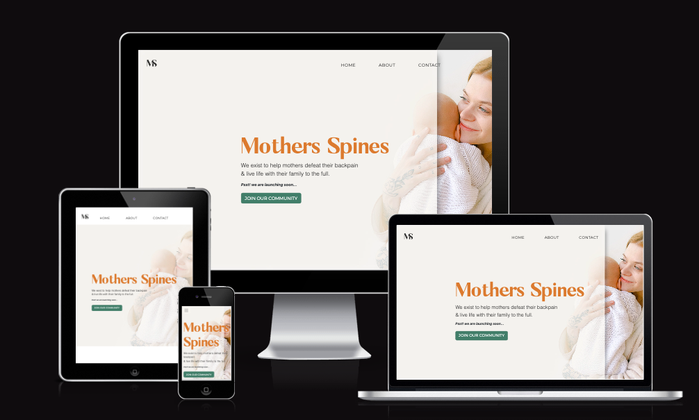
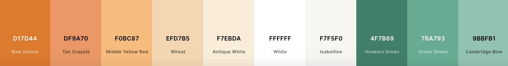
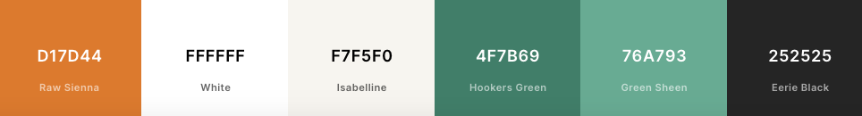
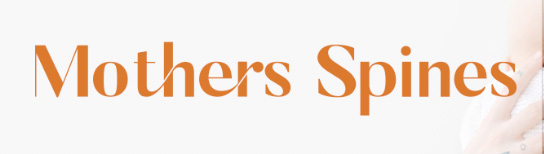
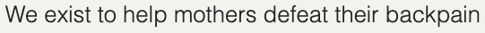
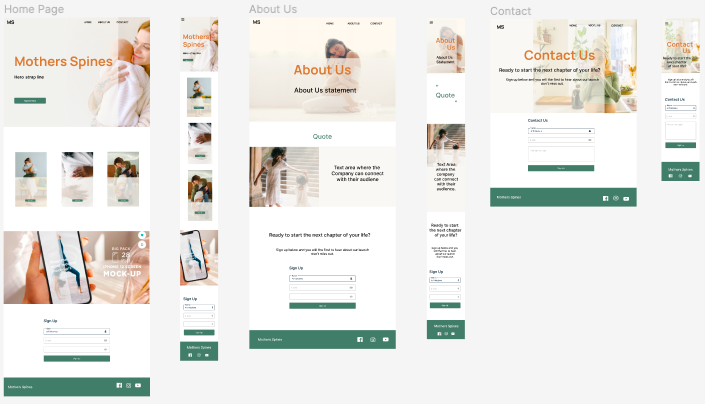
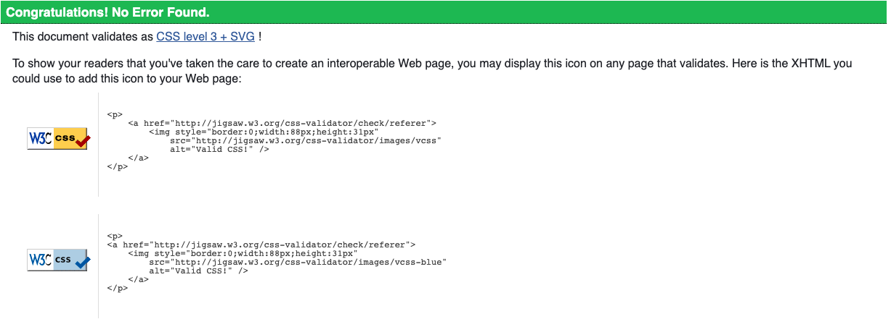
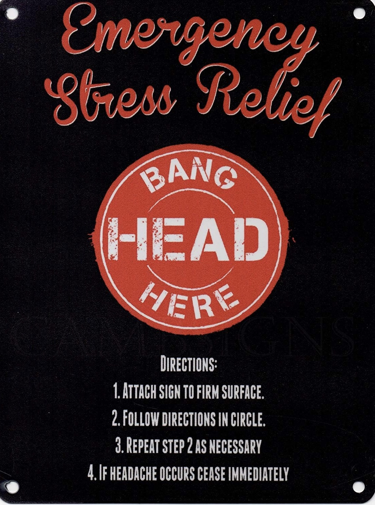

<h1 align="center">Mothers Spines - Pre Launch Membership Sign Up</h1>
<h1 align="center"></h1>

 Live website

 GitHub Repository
 
## About

The brief for this website was to provide the first customer touch point in the customer journey outside of social media for a brand launching a membership in the near future. The purpose of the website is to encourage and enable customers to register their ineterest in signing up early before the official launch date. At present the membership has not been built so the information to be portrayed is that of the ethos and motivation behind the creation of the site, establish and familiarise the customer with the branding and most importantly to capture the email addresses of those interested. 

The membership to be called Mothers Spines is dedicated to building a supportive community of mothers who suffer from back pain. Experts from all relevant fields from back specialists to sleep consultants will be brought in to help guide mothers through their journey of easing their pain and regaining the quality of their life. The brand and service is to be completely different to the program's sold online by certain experts and as such wishes the branding to reflect this, avoiding bright colours and any gimmicky imaging. The user of the site is to feel welcome and feel 'seen' and possibly reflected in the imagery used. The words used to convey the brand are Strong, Warm, Feminine & Supportive. 

## Table of Contents

[User Experience (UX)](#UX)

[Features](#features)

[Technologies Used](#technologies)

[Testing](#testing)

[Deployment](#deployment)

[Known Bugs](#bugs)

[Credits](#credits)

## User Experience (UX)

### User Stories - Customer
- #### A pregnant woman suffering from backpain possibly for the first time or pain that has been excascerbated by pregnancy.
    1. I am tired and in pain i need to instantly know that when i hit the site it is the right place for me to look for support.
    1. This is a stressful time with so much information to absorb that i need the content provided to be short, succinct and easy to read. 
    1. I am pregnant, uncomfortable, in pain and at times very irritable. As such i want the design to be calming and warm and supportive.
    1. This is a new brand so i will want social links so that i can see some social proof of the activity and business.
    1. I will want a way to make contact directly with the brand as i may have additional questions, specifically in regards to whether the membership is right for me.
    1. I may have come directly from the brands social media so will already be familiar with the membership launch details and want to navigate swiftly to the sign up area. 
    
- #### A woman who has recently given birth or who has a child under two and is experiencing back pain. She is finding it hard to navigate her journey to being pain free whilst dealing with motherhood, trying to balance self care with learning the ropes of caring for her child or children.
    1. I am tired, in pain and my free time is very limited i need to instantly know that when i hit the site it is the right place for me to look for support.
    1. Due to my limited available time and potentially bandwidth i need the information to be short and snappy with any instructions to be clear.
    1. I have changed, my body has changed, I need to be be able to see myself in the imagery to feel welcomed.
    1. I need to know that the service understands my pain points and that they will be addressed in the membership.
    1. This is a new brand so i will want social links so that i can see some social proof of the activity and business.
    1. I will want a way to make contact directly with the brand as i may have additional questions, specifically in regards to whether the membership is right for me.
    1. I may have come directly from the brands social media so will already be familiar with the membership launch details and want to navigate swiftly to the sign up area. 

- #### A woman who has given birth over two years ago potentially has more than one child and could have started suffering with back pain recently or have been suffering since or before having her first child meaning that she has a chronic condition.
    1. I have learnt to deal with my back pain over the years and need to understand how this service would benefit me. 
    1. I have tried many different treatments and program's and i need to know why this is different and get an insight of what will it provide for me before signing up.
    1. The design has to be clean, simple and easy to navigate, my life is busy and i want waste time searching for things.
    1. This is a new brand so i will want social links so that i can see some social proof of the activity and business.
    1. I will want a way to make contact directly with the brand as i may have additional questions, specifically in regards to whether the membership is right for me.
    1. I may have come directly from the brands social media so will already be familiar with the membership launch details and want to navigate swiftly to the sign up area.

### User Stories - Business Owner
- #### I am a business owner currently building a membership site for mothers who experience back pain that will be launched soon.
    1. I want to build interest in the launch but also want to be able to capture the email addresses of potential future members or anyone interested. 
    1. I want to be able to reach out to the customers registered on a personably level so i need to also know their name to address the email correctly and in a way that makes them feel seen and heard.
    1. Ideally we would like to know which customer avatar the mother signing up fits into. This will help with directing or marketing in a meaningful way delivering content specific to their current situation.
    1. I want the branding to feel welcoming, supportive and calming. This first brand impression will be important as the feeling experienced by the user at this point will be projected on to the membership and may mean the difference of them wanting to stand out.
    1. This membership provides something different to what is already available. Mothers are targeted by get your body back, snap back marketing and it is extremly important that the design and messaging display the complete opposite to this.
    1. We are a new brand we want to be able to link people to our social media to build our audience and potentially later convert them to a member even if they don't register their interest now. 
    1. Customers must be able to make direct contact with us so that we can answer any questions regarding the membership.

### Design Choices

- #### Colour scheme
    - In order to fulfill the brief of staying away from the brighter gimmicky colours and to reflect motherhood I opted for warm tonal and calming colours. This is a health related website so the accent colours chosen were green. I opted to make the green accent colour the main call to action button colour so that it was instantly recognisable through the site. Hookers Green #4F7B69 stands out without being garish or bright and plays into the calm design, the hover colour Green Sheen #76A793 is a lighter variant and continues this feeling. The Warmth has been acheived by a rusty orange called Raw Sienna #D17D44. In order to remove an element of harshness from the black text i have opted to us Eerie black #252525. A larger colour palatte was selected and from it a small number of main colours were selected and used in order to keep the site looking simple, clean and calming. The business has been provided with the full range of colours in order to start to build their social media and email campaigns in a cohesive manner to the site. Both sets of palattes are provided below for you to see the process used to build the brand colour.

        

        

- #### Typography
    - The main brand identifiable font used is a Sunflora - a unique ligature font sourced from creative market with google font Montserrat secondary font for titles and headings and Source San Pro as the main text font. Sans-serif has been chosen as a fallback font. 
    The Sunflora font was selected purely for the brand headers and call to action on the forms. This font is used in the brand name and has two ligatures within the word mother, i felt this was a good symbol of what the brand stood for almost looking like the letters have their hand on the back of the next letter, supporting them. Due to the ligature i did not want to use it through-out the site should it impact accessibility. I discussed the font as a header within the slack channel a11y-accessibility with positive feedback. 
    I felt Montserrat and Source Sans Pro complemented sunflora with a slight contrast whilst still delivering an easy to read un-decorated font improving accessibility.

    - Sunflora
       
        

    - Montserrat

        

    - Source Sans Pro

        

    - Sunflora was used to create the logo and favicon

         

- #### Imagery
    - I have ensured that the site contains imagery of mothers that would reflect the different customer avatars discussed within the user stories. The membership is to be a welcoming and inclusive membership and as so i have ensured that there is diversity present within the images. The images have to reflect the community that it will serve. My suggestion once launched is that the brand conduct their own branding images of real life members to really show mothers from all ethnicity, religion and walks of life. The images that were selected all have a cool calming light background and all compliment each other. 
    I chose to edit the main hero images to place an opaque overlay on most of the image creating a better background for the readability of text but have left a section of the mother and her child. I was hoping this would relay the sense of looking through a window into someones life as a mother and that potentially this would protray that the brand could see their customers and the battles they face. I continued the opaque overlay within the cards used within the home page for consistency and within the mockup image giving a sneak peak into the potential membership.

- #### Wireframes
    - After roughly sketching an idea of the rough structure i inputed this into Balsamiq to create the following basic wireframes.

         

- #### Mockups
    - After selecting the brand colours and potential imagery i created a mock up of just the desktop and mobile to see if the imagery and colours sat well together. The combination of wireframe and mockup really assisted in ensuring a cohesive calm, warm and welcoming design across all pages.

        

## Features

### Existing Features

#### Common Features Across All Pages
- **Favicon** - 
    - a favicon of the MS logo but in the brand colours is visible on the site tab so that all users can    easily navigate back to the site with ease when multiple tabs are open.
- **Header** - Provide instant impression on the customer and allow them to easily navigate to your desired page
    - I opted to use a transparent navigation and position it right aligned but slighted indented back towards the center so that the menu links stayed visible and were not lost within the background image.
    - The MS brand logo is positioned on the left and is visible on all three pages, It is linked to the home page so that the user can easily navigate home.
    - A line appears under the navigation links when hovered over on desktop view to help the user clearly identify that the element is clickable and which one they are clicking.
    - The navigation toggles into a hamburger memu when viewed on a mobile and small tablets. The background of the links collapse in a personalized hamburger menu when viewed in mobile sizes. The toggle's background has been set as a colour and not transparent to ensure the menu item links aren't lost in the jumbotron text.
    - 
- **Jumbotron**
    - The hero image and content of the jumbotrons all utilise the same colour pallete, font, format and positioning to ensure a cohesive design representative of the brand.
    - A seperate image has been selected using a media query for each device breakpoint. This is due to the fact the text on the smaller devices was being lost against the background. The smaller screens have access to the same image with a small sliver of the mother on show for tablets and the entire iamge being opaque on mobile devices.
    - The text used within the jumbotron reflects that of the page title so reafirm the users nagivation choice but in a friendly conversational tone. The text is set via media query to control the positioning on smaller devices to try and avoid overspilling on to the non opaque image area.
    - The buttons within all of the three jumbotrons link to the sign up form at the bottom of the page to enable people to skip the content and go straight to the sign up if they want. This is hoped to decreased any sign up resistance making it easy to instantly navigate to when landing on the site.
- **Accessibility**
    - All Pages have a description in case the image link breaks as well as helps screen readers.
    - The hamburger menu has aria-label added to let users with screen readers know where the toggleable menu is.
- **Buttons**
    - The same hover transition and colours have been applied to the buttons across all three pages in order to create a cohesive look and make the call to action clear and easy to find. The font is the same for all buttons and the text is also styled in upper case to create a stand out cohesive call to action.
- **Responsiveness**
    - All Pages have been built around Bootstrap 5'S responsive grid layout and provide the same functionality regardless of the viewport size.
- **Footer**
    - The footer contains the copy right for the Brand and reflects the green accents used within the site for the buttons.
    - The navigation has been reflected within the middle of the footer with smaller sized links. This enables the user to navigate without scrolling to the top on the longer pages but isnt too large due to the fact the contact page is short and the user will be exposed to two navs quickly when scrolling
    - Social links with their brand icons have been placed to the right to allow that important brand connection back to social media.
    - The footer is responsive and folds each column ontop of each ther whilst maintianing their clear spaces keeping it as simple as possible to reflect the simple calm asthetics.
    

### Specific to Pages
-  **What do we want**
    - This is a section of three cards that displays the headings containing the customers main pain points and allows the brand to very succinctly demonstrate how they can help. These cards are responsive and change from a group to one card after the other at the relative break points. These cards have an opaque background to tie in with the hero image.
-  **Sign up**
    - This contains the sign up form with a call to action and is present on the home and about page.
    - Included within the sign up form are radio buttons that will help the brand identify what customer avatar each email and name align to.
- **Sneak peak mock up**
    - This is a banner image displayig a mock up of the membership app to provide a small isnight into the what to expect visually from the membership.
- **Quote**
    -  A quote under the about section that reflects the brand. This is a responsive element that will resize with the breakpoints of each device.
- **About cards**
    - Two cards containing an image and text providing further information regarding the drive behind creating the service. Responsive elements that shift so that the image is above and below the text in mobile.
- **Contact form**
    - a contact form providing a message area to enable direct contact with the brand.
    - I have maintained the radio buttons to select the customer avatar within the contact form as it will potentilly provide context to the messages received and allow the brand to reply in a more informed and connected way. 

### Features to be implemented to improve service
- GDPR related check boxes and information within the sign up and contact forms.
- The customers ability to select how many children they when submitting the sign up and contact forms.
- A definition of the word Mother to ensure that the brands message is inclusive of all people gender irrelevant and whether they have birthed a child or not who identify with the name mother. 

### Features to be added
- Once the brand is more established a social links fully populated then i would advise potentially adding in an instagram carosel to show what the brand are currently up to.
- Once the launch date is confirmed the site should be updated with a countdown clock with any early bird pricing. 

### Technologies Used

### Languages Used

- [HTML5](https://en.wikipedia.org/wiki/HTML5)
- [CSS3](https://en.wikipedia.org/wiki/Cascading_Style_Sheets)
- [JavaScript](https://www.javascript.com/)

### Frameworks, Libraries, Programs, Online Resources Used

- [Git](https://git-scm.com/) 
- [GitPod](https://www.gitpod.io/) 
- [Github](https://github.com/) 
- [Bootstrap v5](https://getbootstrap.com/) - Responsive Elements Hero, Jumbotron, Cards, Navigation & Forms
- [jquery](https://jquery.com/) - Used for the toggle function in the navigation
- [Google Fonts](https://fonts.google.com/) - Montserrat and Source Sans Pro fonts
- [Creative Market](https://creativemarket.com/NewTropical/3737195-Sunflora-Unique-Ligature-Font) - Sunfora Font resourced from Tropical Type
- [Creative Market](https://creativemarket.com/Dikarte/5819319-iPhone-12-Pro-Mockup) - Mockup image present on the home page resourced from Dikarte Media
- [Font Awesome](https://fontawesome.com/) - Social media Icons, Arrows within text and paper plane on the contact form button.
- [Photoshop](https://www.adobe.com/ie/products/photoshop.html - images have been resized and edited within photoshop.
- [Coloors](https://coolors.co/) - Used to create the colour palettes and identify complimentary and contrasting colours. This was also used to check the accessibilty of the text colour with each background colour during the planning stage. 
- [RGBA Color Picker](https://rgbacolorpicker.com/hex-to-rgba) - to match hex colours to an RGBA so that i could change the apacity accurately.
- [Pexels](https://www.pexels.com/)- pexels used for all imagery within the site. image credit as follows
     - [Hero Home Image](https://www.pexels.com/photo/woman-in-beige-sweater-carrying-baby-3845328/) Photo by Anna Shvets from Pexels
     - [Hero About Image](https://www.pexels.com/photo/mother-kissing-her-cute-baby-3763587/) Photo by Jonathon Borba from Pexels
     - [Hero Contact Image](https://www.pexels.com/photo/pregnant-woman-drinking-hot-beverage-7155648/) Photo by Yan Krukov from Pexels
     - [Home Card 1](https://www.pexels.com/photo/mother-hugging-daughter-in-living-room-10557896/) Photo by Ron Lach from Pexels
     - [Home Card 2](https://www.pexels.com/photo/crop-pregnant-black-woman-touching-belly-6991889/) Photo by Shvets Production from Pexels
     - [Home Crad 3](https://www.pexels.com/photo/mother-and-son-playing-together-9478813/) Photo by Ron Lach from Pexels
     - [About Card 1](https://www.pexels.com/photo/a-woman-holding-hands-with-her-daughter-7879751/) Photo by Barbara Olsen for Pexels
     - [About Card 2](https://www.pexels.com/photo/mother-sitting-on-bed-holding-a-baby-5889960/) Photo by Nataliya Vaitkevich for Pexels
- [Fiver](https://www.fiverr.com/gemmawilson?source=inbox) Logo png files and favicon created by Gemma Wilson
- [Figma](https://www.figma.com/file/1ZW6VpUUhfnSgOvLOVr47v/Mothers-Spines-1st-Wireframe?node-id=0%3A1) used to create mock up designs
- [Balsamiq](https://balsamiq.com/wireframes/desktop/) Used to create the initial wireframes

## Testing

 ### Functionality Testing
- Navbar - visible on all viewports collapsing down into a toggle hamburger at the correct breakpoint. Navbar transparent remains and the backgroud colour appears to make the toggle menu readable. All links clickable and take you to the correct pages. Logo takes you to the home page. All hover transitions working.
- Footer Navbar - All links connected to the correct page, all hover links work and the transition to tablet and mobile view is clear and correct. 
- Footer Social Icons - all linked to the correct external sites and set to open in a new page. Visible in all viewports.
- sign up and contact forms - all fiels editable with the relevant text.
- All cards resize correctly keeping the text and images clear and readable.
- All internal links coonected to the buttons tested. 

### CSS3 validator - Pass

### HTML5 validator
- Home - Document checking completed. No errors or warnings to show.
- About - Document checking completed. No errors or warnings to show.
- Contact - Document checking completed. No errors or warnings to show.

### External testing
- All testers confirmed that all buttons and navigation links performed the correct function. 
- The testers provided feedback on the opacity used on the cards within the home page stating that the opacity was such that the text was hard to read. The opacity was increased an re-tested by the users who were satisfied that the text was now clearly readable.
- Initially the about page contained one card with all of the about information. The feedback from users was that this was hard to read all together and due to the responsive element and amount of text the text size was quite small. This was tackled by breaking the content over two responsive horizontal cards and increasing the font size. This received better feedback from the users saying it was easier to read and digest.
- Testers on tablets and mobiles identified that the images added via media query had negative space above the hero image and navigation. This was corrected by adding all of the css styling to the medi query and not just stipulating the image change.
- During the testing process a gutter along the entire right side of the site pages was discovered. I identified an area within the footer to be responsible with a css style rule targeting the padding of a row. This was removed and all gutters disapeared. 

### Compatibility Testing
- Browser Compatibility tested via [Browser Stack](https://live.browserstack.com/) 
- tested on the latest versions of the following
    | Safari    | Firefox   | Chrome  | Opera  | Edge  |
    | --------- |:---------:| -------:| ------:| -----:|
    | Pass      | Pass      | Pass    | Pass   | Pass  | 
    
- Chrome developer tools has been used to check the responsiveness of the site across different screen sizes and devices. 
- The site has mostly been built and tested on a Macbook Air operating on MacOs Catalina.

### Performance Testing
-  The performance of the site was tested on the following site with satisfactory results. [Web Page Test](hhttps://www.webpagetest.org/result/221027_BiDcTE_26K/)

### Testing User Stories 
### User Stories - Customer
- I feel that the user stories of all three avatars are mirror the same core principles. A simple design with imagery that is reflective of them. Clear snippets of information that are easy to digest. A simple layout with quicklinks to the purpose of the site sign up, meaning users can navigate with ease. The hero images and jumbotron content allow the user to instantly identify the page they are on and redirect themselves with ease from the top or bottom Nav. The about page provides enough additional information to make an informed choice on sign up without being overwhelming. The contact page allows the oportunity to connect further with the brand. The imagery, font and colours have acheived a clean warm design that feels welcoming to its users.

### User Stories - Business Owner
- The emphasis within the site is the email sign up, every button within the jumbotrons all link directly to this allowing a resistance free path for the user to sign up after landing on the pages.
- The sign up form accomdates for Name and with the addition of radio buttons for users to select their user avatar - informing the business and allowing them to target specific marketing messages to that individual.
- The Brand created is warm, clean, light and far away from gimmicky colours and other brands that they wanted to stay away from. 
- The content within the site is conversational and sets a supportive you are being heard and seen tone to the site.
- The contact page allows the customers direct access to the brand. This will also capture the avatar information and allow them to customise their response.
- Social links are provided within the footer to allow the brand to grow their social media. These links have been kept small and at the bottom as the current focus of the site is sign ups and larger social media links may distract the user away from the site before signing up.

## Deployment

### Publishing
This website was published using [GitHub Pages](https://pages.github.com/). The procedure is outlined below.
1. Go to the GitHub website and log in.
2. On the left-hand side, you'll see all your repositories, select the appropriate one. ([Repository](https://github.com/liigalized/MS1_boredom_guide) used for this project).
3. Under the name of your chosen Repository you will see a ribbon of selections, click on 'Settings' located on the right hand side.
4. Scroll down till you see 'GitHub Pages' heading.
5. Under the 'Source' click on the dropdown and select 'master branch'
6. The page will reload and you'll see the link of your published page displayed under 'GitHub' pages.
7. It takes a few minutes for the site to be published, wait until the background of your link changes to a green color before trying to open it.

### Forking
If you wish to contribute to this website you can Fork it without affecting the main branch by following the procedure outlined below.
1. Go to the GitHub website and log in.
2. Locate the [Repository](https://github.com/liigalized/MS1_boredom_guide) used for this project.
3. On the right-hand side of the Repository name, you'll see the 'Fork' button. It's located next to the 'Star' and 'Watch' buttons.
4. This will create a copy in your personal repository.
5. Once you're finished making changes you can locate the 'New Pull Request' button just above the file listing in the original repository.

### Cloning 
If you wish to clone or download this repository to your local device you can follow the procedure outlined below.
1. Go to the GitHub website and log in.
2. Locate the [Repository](https://github.com/liigalized/MS1_boredom_guide) used for this project.
3. Under the Repository name locate 'Clone or Download' button in green.
4. To clone the repository using HTTPS click the link under "Clone with HTTPS".
5. Open your Terminal and go to a directory where you want the cloned directory to be copied in.
6. Type `Git Clone` and paste the URL you copied from the GitHub.
7. To create your local clone press `Enter`

## Known Bugs

There are no identified bugs at present. The text size and responsiveness has been the most temperomental element within this design and i would, if starting again change the opauqe overlay behind the jumbotron text and over the Hero image to a responsive div that would contain the text through all devices and screen sizes rather than a static overlay contained within the image. Sadly once i had realised this there was not enough time to reverse the design before submission but i will take this lesson on to the next project. 

## Credits

### Code 

- The majority of the code originated from the Bootstrap library and was styled with custom css.
- Hover elements inspired and adapted from [30 seconds of code](https://www.30secondsofcode.org/css/s/hover-underline-animation )
- The following code snippets were copied with permision;
- Tutor Support helping me to identify an issue with the Navbar not appearing transparent initially;
Tutor Sean
nav {
 width: 100%;
}

ul .nav {
 flex: 1,
 justify-content: flex-end;
}
- The following code was suggested by Slack user to assist with removing the logo from the toggle menu;
Slack User isherwood
d-sm-block d-none

- All of the rest of the code was written by the author - Philippa Ellis

### ReadMe Resources
- [Markdown Cheatsheet](https://github.com/adam-p/markdown-here/wiki/Markdown-Cheatsheet#code)
- Code Institute [SampleREADME](https://github.com/Code-Institute-Solutions/SampleREADME)
- Slacks numerous Markdown questions and answers
- Template for the format of this Readme document has been isnpired by and adapted **please note that the deployement, publsihing and forking instructions have been copied directly from this readme document and all credit for that section of this file goes to [Liga Baikova ](https://github.com/LigaMoon/Boredom-guide/blob/master/README.md#)

I have also found this very helpful through the process of completing my first project

